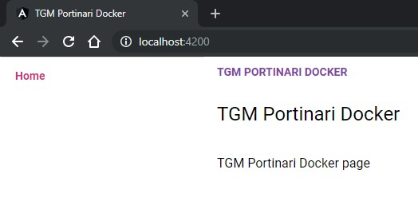

# Portinari quick start com Docker

## Motivação

Faz tempo que venho estudando esses frameworks Javascript da moda, tipo React, Vue e Angular.

Agora com a liberação do THF como Portinari, resolvi dar um gás no Angular.

Mas, cada vez que vou iniciar uma aplicação é aquela sofrência, npm install, baixa a internet inteira e aguarda.

Bom, como também to estudando muito docker, achei facilmente um monte de imagens prontas, já com Node, Angular, Ionic e até com JDK do Java pra conectar com o device.

Mas, usar o pronto não tem graça, o legal é fazer o meu mesmo. Então, dá-lhe quebrar a cabeça pra montar essas maquininhas:

## Testes basicos

Comecei montando uma maquina simples, só instalando o Angular-CLI, e já coloquei o Ionic também:

```Dockerfile
FROM node:12.8.0-alpine

RUN apk add yarn && \
    npm install --quiet --no-progress -g @angular/cli@8.0.1 &> /dev/null && \
    npm install --quiet --no-progress -g ionic@4.1.2 &> /dev/null


CMD ["/bin/sh"]
```

O Alpine é a menor distro Linux que encontrei, e eu queria imagens bem pequenas.

Mas o problema é que ele é totalmente seco, e dá uma puta trabalheira se precisar instalar muita coisa nele.

O legal dele é pra distribuir só o App já rodando, mas pra montar uma máquina de desenvolvimento acho que não é a melhor opção.

Bom, dockerfile na mão, experimentei buildar a maquineta e ver se conseguia tocar a vida e deixar as coisas rodando de vez.

Depois de montar a máquina com Angular e conseguir instalar tudo manualmente e fazer rodar, resolvi de fazer com duas frentes:

1 - Uma máquina com o Portinari, todo instalado e com um projeto modelo
2 - Uma máquina com Ionic "Portinarizado", também prontinha, já com tudo o que for necessário pra sair buildando app.

Pra ambas eu pretendo fazer versões com o Tema do THF aplicado, e algumas aplicações inicializadas, tipo login, um "Crudizinho", configuração de i18n. E outras coisinhas que a gente vai se batendo pra configurar num projeto THF do Zero.

## Hora de iniciar a máquina do Portinari com base na de Angular Puro

```Dockerfile
FROM tgmti/angular:0.0.1

LABEL maintainer="Thiago Mota <tgmspawn@gmail.com>"
LABEL version="0.0.1"
LABEL title="Portinari Start Container"
LABEL description="A started Portinari project"
LABEL "https://portinari.io"="Portinari UI"

WORKDIR /app

RUN ng new my-po-project --skipInstall --skip-git

WORKDIR /app/my-po-project

RUN npm install

RUN ng add @portinari/portinari-ui

RUN npm install @portinari/portinari-templates

RUN sed -i 's/ng serve/ng serve --host 0.0.0.0/g' package.json

EXPOSE 4200

CMD ["npm","start"]
```

Nesse caso já ajustei o script `ng serve` pra servir 0.0.0.0, senão ele não aceita conexões do Host Windows (aí vai servir pra quê afimal?)

Funcionou que foi uma beleza, aparece a página, aplicação já inicializada, achei massa! Só que...

Se eu faço mapeamento do volume, lá se vai a pasta:
`docker run --rm -v "${PWD}:/app -p 4200:4200 tgmti/ionic:0.0.1-buster`

Claro né animal, se montar uma pasta do Host dentro do Container, o que estava lá vai ser apagado (técnicamente fica no layer da imagem e nem chega a subir pro FS do container, mas na hora de usar é o mesmo que deletado).

## Como diabos fazer pra mapear uma pasta do Windows e replicar os dados do Linux pra dentro do Windows? 

Puta merda, aí eu sofri heim. Tentei só copiar, ou mover a pasta, mas sempre demorava uma eternidade pra processar a node_modules. E é examente por causa dessa bagaça que eu quero usar container.

Se monto uma pasta do Host dentro do container, no fim das contas replicar aquela pasta aqui é copiar arquivos entre filesystems diferentes.

Tentei compactar a node_modules e descompactar na hora de iniciar o container, consegui várias formas de mapear o container pra fazer a replicação automática.

Sempre que eu testava só com os arquivos da src, era uma beleza, mas colocando a node_modules o bicho sentava, e demorava as vezes mais que o npm install normal (pelo menos na minha percepção).

Comecei a pensar em outras formas, se eu deixar a máquina rodando só dentro do Linu, e abrir o VsCode lá dentro.

## VsCode + Docker = Um milhão de opções

A opção mais na cara do gol é instalar o VsCode na própria maquineta, ou em uma outra, e criar um volume compartilhado pras duas.

### VsCode no Linux compartilhando o Volume

Pro VsCode eu não quis perder muito tempo, fui direto atrás de quem manja, e achei uma mina Belga que só tem imagem top [Maartje Eyskens](https://github.com/meyskens/), dei pull na imagem [meyskens/vscode](https://hub.docker.com/r/meyskens/vscode/dockerfile), abri um xServer e apontei o DISPLAY do Linux pra ele. Foi na hora.

Coisa lindja de tudo, funciona bem rápido, dá pra instalar as extensões.

Bem funcional, mas essa não é nada, eu paguei pau quando vi essa outra máquina aqui [meyskens/vscode-maartje](https://github.com/meyskens/docker-vscode-maartje/blob/master/Dockerfile). Caramba meu, um ambiente completasso!!! Tem até Docker dentro do Docker, e eu fiquei tipo "WTF???". Ainda bem que ela comentou:

```bash
    #Install Docker, what??? Why are you looking that way at me?
    RUN curl https://get.docker.com | bash
    RUN apt-get -y install docker-compose
```

Hahaha, depois de perder um tempão admirando estas configurações, e mais umas outras que foram aparecendo, voltei pra minha saga.
Montei um docker-compose.yml pra subir as duas maquinetas juntas

```yml
version: "3.7"

services:

portinari:
    image: tgmti/portinari
    ports: 
        - 4200:4200
    volumes: 
        - portinari_app:/app

vscode:
    image: meyskens/vscode
    environments:
        - DISPLAY=10.0.0.11:0.0
    volumes:
        - portinari_app:/app

volumes:
    portinari_app:

```

`docker-compose up -d` e "seje feliz"! Sem grilos, sem problemas, sem as minhas extensões e configurações.

Ai ai, eu ia ter que ficar horas trabalhando em cima pra montar uma máquina do meu jeito, igual a da menina Belga. E outra, eu quero usar o VsCode no Windows, não porque é melhor, só porque eu não consegui fazer ainda.

Então, já que desse jeito eu sei que funciona, parti pra ver os outros links que apareceram na pesquisa `docker vscode`.

### VsCode Server dentro do Container 

A Microsoft lançou um pacote de extensões sensacional pra trabalhar com Docker.
A extensão Docker eu já uso a um tempo, apesar de que eu costumo mesmo é rodar um docker exec, ao invés de clicar com o direito em attach terminal.

Só que o pacote [Remote Development](https://marketplace.visualstudio.com/items?itemName=ms-vscode-remote.vscode-remote-extensionpack) é coisa de maluco:

- Remote SSH
- Remote Containers
- Remote WSL

Caramba, fui direto nessa terceira, rodei um docker run dentro do wsl, criando uma pasta na home e mapeando pro volume, mas deu pau nas permissões. Putz, deixei pra lá (depois tenho que tentar outra vez).

Remote SSH eu já sabia como ia funcionar, dei uma fuçada pra ver se tinha algum jeito de fazer sem mexer no dockerfile, humm, serve um monte, mas não pra o que eu queria agora.

Remote Container é show. Dá pra selecionar quais extenções serão instadas dentro do container, e ela já sai fazendo tudo sozinha, configurando as portas, instalando o VSCode Server, Instalando as extenções, monta o docker-compose, cria um Dockerfile. 

Faz tudo sozinha. Vai ser bem útil no futuro, mas ainda demora muito, e também, se eu tivesse afim de pegar o negócio pronto, não tinha partido do zero (ah, lembrei agora foi nessa hora que eu mudei do alpine pro Debian Buster Slim na verdade, o VsCode não conseguia instalar as coisas no alpine, o vscode-insiders consegue, mas deu pau, acho até que vou tentar voltar pro alpine depois).

### Ainda não tava do jeito que eu queria.

Não que as opções que achei não fossem sensacionais, é que, pra compartilhar isso, tem que ser bem fácil, e de preferência rodar no Windows Home com Dockertools da firma, por isso, voltei pra pesquisa.

Pensei um pouco mais no que aprendi nessas brincadeiras.
- Quando eu compartilho um volume com o Windows (`-v c:\temp:/app`) dá pra usar localmente, mas fica lento pra copiar a node_modules
- Se eu mapear a pasta do app inteira, tenho que usar recursos bem mais complicados pra acessar a pasta através de outro container, ou com as extenções do VsCode.
- Mas se eu criar o volume só na estrutura dos containers, fica super rápido.

# E finalmente

    E se eu mapear o /app, mas não o /app/node_modules?

__Google, diz aí__: `docker map volume exclude subfolder`

E o stackoverflow nosso de cada dia não deixou na mão: [Add a volume to Docker, but exclude a sub-folder](https://stackoverflow.com/questions/29181032/add-a-volume-to-docker-but-exclude-a-sub-folder)

    Using docker-compose I'm able to use node_modules locally, but ignore it in the docker container using the following syntax in the docker-compose.yml
```yml
    volumes:
    - './angularApp:/opt/app'
    - /opt/app/node_modules/
```
    So everything in ./angularApp is mapped to /opt/app and then I create another mount volume /opt/app/node_modules/ which is now empty directory - even if in my local machine ./angularApp/node_modules is not empty.

Caramba, porque que sempre tem um jeito 300x mais simples de fazer as coisas quando a gente tentou um monte de coisa mais difícil.

Funcionou que é uma maravilha. Navalha de Occam, a explicação mais fácil, a menor quantidade de passos. Que coisa de loko!!!

***

# Compartilhando:

Ainda vou mexer nesse repo, mas a versão de agora está taggeada como 0.0.1.

https://github.com/tgmti/docker-dev-utils

## Ficou um pequeno problema ainda:

Quando mexo em um arquivo pelo Windows, o servidor não recompila o código automaticamente.

Pra resolver eu dou um "toque" nele pelo shell do container: `touch src/app/app.component.html`

Anotei essa [Issue](https://github.com/tgmti/docker-dev-utils/issues/1) pra resolver outra hora.

***

# Conclusão

Passei trabalho? 
- Nãaa, que isso?

Valeu a pena? 
- Bagarai véi. Tentando fazer a bagaça funcionar do meu jeito, sem pegar muita coisa pronta, aprendi uma porrada de coisa. Sobre Node, Angular e Ionic Cli, VsCode Remote, Linux e principalmente Docker

***

# TL;DR

Pra montar tudo numa máquina só, basta seguir a receitinha:

Dockerfile

```Dockerfile
FROM node:12.8.1-buster-slim

LABEL maintainer="Thiago Mota <tgmspawn@gmail.com>"
LABEL version="0.0.1"
LABEL title="Portinari Start Container"
LABEL description="A started Portinari project"
LABEL "https://portinari.io"="Portinari UI"

# Determina se vai iniciar o Server ao criar/iniciar o container
ENV INIT_NG_SERVER=true

EXPOSE 4200

RUN apt update && \
    apt install -y yarn

RUN npm install -g @angular/cli
RUN npm install -g npm-add-script

WORKDIR /

RUN ng new app --skipInstall --skip-git

WORKDIR /app
RUN npm install
RUN ng add @portinari/portinari-ui
RUN npm install @portinari/portinari-templates

RUN sed -i 's/ng serve/ng serve --host 0.0.0.0/g' package.json

COPY ./start.sh /
RUN chmod 777 /start.sh

# Guardo os arquivos gerados na pasta /template, exceto os node_modules
RUN mkdir /template/
RUN cp -rf `ls -A | grep -v "node_modules"` /template/

COPY ./start.sh /start.sh
CMD ["/start.sh"]

```

start.sh
```sh
#!/bin/sh

if find angular.json 2>/dev/null; then
    echo "App exists"
else
    echo "Copy template to app directory..."
    cp -rf /template/* /app/
fi

if $INIT_NG_SERVER ; then
    echo "Starting ionic Server..."
    npm start
else
    bash
fi
```

docker-compose.yml

```yml
version: "3.7"

services:

  portinari:
    image: tgmti/portinari:0.0.1-buster
    ports:
      - 4200:4200
    volumes:
      - .:/app
      - node_modules:/app/node_modules
    tty: true
    environment:
      - INIT_IONIC_SERVER=false

volumes:
  node_modules:
```

Executou: `docker-compose up`

E já aparece:



***
